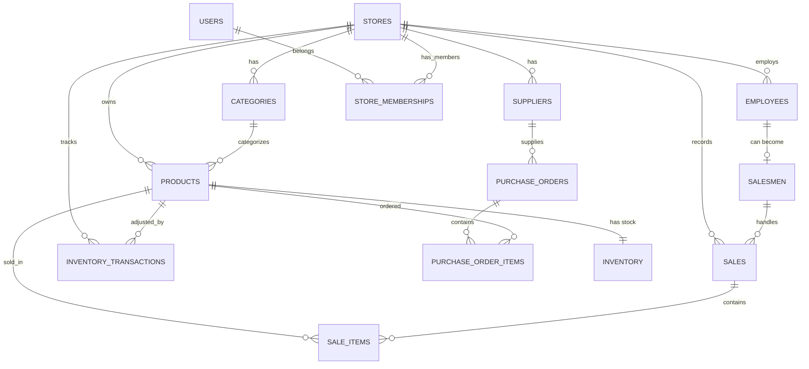

# SuperStore Manager — Product Specification

Market-ready feature specification for the SuperStore Manager MERN application. Use this document as the single source of truth when building, selling, or onboarding customers.

---

## 1. Product Vision

**SuperStore Manager** is a multi-tenant SaaS for small-to-medium retail stores (grocery, electronics, clothing, pharmacy) to manage products, inventory, point-of-sale, sales reporting, and staff.

**Positioning:** *All-in-one store management — products, stock, sales, and team — in one dashboard.*

**Tech stack:** React (Vite) + Node.js/Express + MongoDB (Mongoose) + JWT auth.

---

## 2. Current Implementation Status

| Module | Frontend | Backend | Status |
|--------|----------|---------|--------|
| Auth (Login / Signup) | Yes | Yes | Working |
| Store profile | Partial | Partial | Basic |
| Products CRUD | Yes | Yes | Working |
| Employees | Yes | Partial | List + create only; update/delete API missing |
| Inventory | UI only | No | Mock data on frontend |
| Sales / POS | UI only | No | No API routes |
| Salesmen | UI only | No | No API routes |
| Dashboard | UI only | No | Stats API missing; monthly chart uses random data |
| Multi-store per owner | Partial types | No | Not implemented |
| Roles & permissions | UI hints only | No | Not implemented |

---

## 3. Entity Relationship Overview



**Golden rule:** Every child record has `store_id`. The JWT provides `storeId` — all reads and writes must filter by it. Never trust a client-supplied `store_id`.

See [DATABASE_SCHEMA.md](./DATABASE_SCHEMA.md) for full Mongoose schema examples.

---

## 4. Module Specifications

### 4.1 Authentication & Onboarding

| Feature | Priority | Edge Cases |
|---------|----------|------------|
| Store owner registration | P0 | Email taken, weak password validation |
| Login with JWT | P0 | Expired token, invalid token, brute-force rate limit |
| Logout | P0 | Clear token client-side |
| Forgot password / reset email | P0 | Token expiry, single-use link |
| Email verification | P1 | Resend cooldown |
| Session refresh token | P1 | Rotate on use |
| 2FA (TOTP) | P2 | Backup codes |
| Onboarding wizard | P1 | Add first product + employee; allow skip |

---

### 4.2 Store Management

| Feature | Priority | Edge Cases |
|---------|----------|------------|
| View / edit store profile | P0 | Name, location, phone, logo |
| Store settings (currency, tax, timezone) | P0 | Tax auto-applied in POS |
| Multi-store per owner | P1 | Store switcher in sidebar |
| Store deactivation | P2 | Data retention policy |
| Business hours | P2 | Optional |

---

### 4.3 Products

| Feature | Priority | Edge Cases |
|---------|----------|------------|
| List with pagination | P0 | Empty state |
| Search by name / SKU / barcode | P0 | Debounced search |
| Filter by status, unit, category | P0 | |
| Create / Edit / Delete | P0 | Soft delete if product has sales history |
| Bulk import (CSV) | P1 | Invalid rows report |
| Bulk export (CSV / PDF) | P1 | |
| Product image upload | P1 | Max size, allowed formats |
| Barcode generation | P2 | |
| Duplicate SKU detection | P0 | Unique per store (compound index) |
| Price history | P2 | Track margin changes over time |

**Business rules:**
- SKU unique per store, not globally.
- Do not hard-delete products referenced in sales — set `is_active: false`.
- Warn when `selling_price < cost_price` but allow (promotions).

---

### 4.4 Inventory

| Feature | Priority | Edge Cases |
|---------|----------|------------|
| Stock levels per product | P0 | Currently mocked on frontend |
| Low stock alerts | P0 | Dashboard badge + optional email |
| Manual stock adjustment | P0 | Reason required |
| Restock (add quantity) | P0 | Updates `last_restocked_at` |
| Stock transfer (multi-branch) | P2 | Between stores |
| Inventory transaction history | P1 | Full audit trail |
| Expiry date tracking | P2 | Pharmacy / grocery |
| Batch / lot numbers | P2 | |

**Business rules:**
- Block sale when `quantity < requested_qty` unless store allows negative stock.
- Use atomic `$inc` with condition `{ quantity: { $gte: qty } }` for concurrent sales.
- Reject restock with zero or negative quantity.

---

### 4.5 Sales / POS (Point of Sale)

| Feature | Priority | Edge Cases |
|---------|----------|------------|
| Product search in POS | P0 | Barcode scanner (keyboard wedge) |
| Shopping cart | P0 | |
| Apply discount (flat / %) | P0 | Max discount cap per role |
| Tax calculation | P0 | Rounding rules |
| Payment methods | P0 | cash, card, UPI, bank_transfer |
| Assign salesman | P0 | Optional |
| Complete sale → deduct stock | P0 | MongoDB transaction (atomic) |
| Print / download receipt | P1 | PDF |
| Sale list & detail view | P0 | |
| Cancel sale (same day) | P1 | Restock items |
| Refund (partial / full) | P1 | New return record, don't edit original |
| Hold / resume cart | P2 | |
| Offline POS mode | P3 | Sync when online |
| Split payment | P2 | Cash + card |

**Critical sale flow:**

```
Cart → Validate stock → Create Sale + SaleItems
  → Decrement Inventory → Create InventoryTransactions
  → Update Salesman total_sales → Return receipt
```

Use a MongoDB **session transaction** so sale creation and stock deduction succeed or fail together.

---

### 4.6 Salesmen

| Feature | Priority | Edge Cases |
|---------|----------|------------|
| List salesmen | P0 | |
| Promote employee → salesman | P0 | Employee must exist and be active |
| Commission rate & monthly target | P0 | |
| Performance dashboard | P1 | vs target |
| Leaderboard | P2 | |
| Deactivate salesman | P0 | Block new sale assignment |

**Business rules:**
- One employee → at most one salesman record.
- Commission calculated on `final_amount` after discount.
- Inactive salesman cannot be assigned to new sales.

---

### 4.7 Employees / HR (Lite)

| Feature | Priority | Edge Cases |
|---------|----------|------------|
| CRUD employees | P0 | Backend missing update/delete |
| Role & department filters | P0 | |
| Active / inactive status | P0 | `is_active` field needed on model |
| Salary field (private) | P1 | Only owner/manager can view |
| Attendance / shifts | P3 | Future module |
| Payroll export | P3 | |

**Business rules:**
- Deactivate salesman before deactivating linked employee.
- Duplicate email within same store → HTTP 409.
- Soft delete employees with sales history.

---

### 4.8 Dashboard & Reports

| Feature | Priority | Edge Cases |
|---------|----------|------------|
| Total revenue, sales count | P0 | Real API — not random data |
| Today's sales | P0 | Timezone-aware |
| Low stock count | P0 | |
| Total products & employees | P0 | |
| Monthly revenue chart | P0 | Last 12 months |
| Recent sales table | P0 | |
| Top selling products | P1 | |
| Profit margin report | P1 | selling_price − cost_price |
| Sales by payment method | P1 | |
| Sales by salesman | P1 | |
| Export reports (PDF / Excel) | P1 | |
| Date range filters | P1 | |
| Period comparison | P2 | This month vs last month |

---

### 4.9 Users, Roles & Permissions

| Role | Permissions |
|------|-------------|
| Owner | Full access |
| Manager | All except billing / delete store |
| Cashier | POS, view products, view own sales |
| Warehouse | Inventory only |
| Accountant | Reports, view sales, no delete |

**Edge cases:**
- Cashier cannot view salary data.
- Cashier cannot delete products.
- Enforce roles in API middleware, not only in UI.

---

### 4.10 Notifications & Alerts

| Feature | Priority |
|---------|----------|
| Low stock email / in-app | P1 |
| Daily sales summary email | P2 |
| New employee welcome | P2 |

---

### 4.11 Settings & Admin

| Feature | Priority |
|---------|----------|
| Change password | P0 |
| API rate limiting | P0 |
| Data backup export | P1 |
| Subscription / billing (Stripe) | P1 for SaaS |
| Trial period (14 days) | P1 |

---

## 5. API Endpoints

### Implemented

```
GET    /api/health
POST   /api/auth/register
POST   /api/auth/login
POST   /api/auth/logout
GET    /api/auth/me
GET    /api/products
POST   /api/products
GET    /api/products/:id
PUT    /api/products/:id
DELETE /api/products/:id
GET    /api/employees
POST   /api/employees
```

### Required (not yet implemented)

```
PUT    /api/employees/:id
DELETE /api/employees/:id
PATCH  /api/employees/:id/status

GET    /api/inventory
POST   /api/inventory/restock
POST   /api/inventory/adjust
GET    /api/inventory/transactions
GET    /api/inventory/low-stock

GET    /api/sales
POST   /api/sales
GET    /api/sales/:id
GET    /api/sales/:id/items
POST   /api/sales/:id/cancel
POST   /api/sales/:id/refund
GET    /api/sales/pos-products

GET    /api/salesmen
POST   /api/salesmen
PUT    /api/salesmen/:id
DELETE /api/salesmen/:id
GET    /api/salesmen/available-employees

GET    /api/dashboard/stats
GET    /api/dashboard/recent-sales
GET    /api/dashboard/monthly-chart
GET    /api/dashboard/top-products

GET    /api/store
PUT    /api/store

GET    /api/categories
POST   /api/categories
PUT    /api/categories/:id
DELETE /api/categories/:id
```

---

## 6. Edge Cases Master Checklist

### Data Integrity
- [ ] All queries scoped by `store_id` from JWT
- [ ] MongoDB transactions for sale + inventory update
- [ ] Unique indexes: `(store_id, sku)`, `(store_id, email)` on employees
- [ ] Soft delete for products / employees with history

### Concurrency
- [ ] Two cashiers selling the last item — only one succeeds
- [ ] Conditional inventory updates prevent negative stock

### Validation
- [ ] Prices ≥ 0
- [ ] Discount ≤ subtotal
- [ ] Phone / email format validation
- [ ] Max cart items and max quantity per line

### Security
- [ ] Password min 8 chars, bcrypt cost 10+
- [ ] JWT expiry (e.g. 7 days) + optional refresh
- [ ] Rate limit login (e.g. 5 attempts / 15 min)
- [ ] Helmet, CORS whitelist in production
- [ ] Never return password in API responses
- [ ] Input sanitization (NoSQL injection prevention)

### UX
- [ ] Empty states on every list page
- [ ] Loading skeletons
- [ ] Error toasts with clear messages
- [ ] Confirm dialog before delete
- [ ] Unsaved form warning

### Business Logic
- [ ] Cannot sell inactive product
- [ ] Cannot assign inactive salesman
- [ ] Sequential invoice numbers per store (e.g. `INV-2026-00001`)
- [ ] Timezone-aware "today's sales"
- [ ] Consistent currency formatting (frontend + backend)

---

## 7. Sell-Tomorrow MVP (24–48 Hour Plan)

### Day 1 — Replace mocks with real APIs
1. Inventory model + API → connect `InventoryPage`
2. Sales + SaleItems models + API → connect `SalesPage` POS
3. Salesmen model + API → connect `SalesmenPage`
4. Dashboard stats API → real numbers from DB
5. Employee update / delete endpoints

### Day 2 — Make it demo-ready
6. Atomic sale transaction (stock deduction)
7. Low stock alerts on dashboard
8. Auto invoice number on each sale
9. Print-friendly receipt view
10. Store settings (tax rate auto-applied in POS)
11. Seed script with demo data
12. Deploy (e.g. Railway + Vercel) with live URL

### Demo script for buyers
1. Register store → login
2. Add 5 products
3. Restock inventory
4. Add 2 employees, promote 1 to salesman
5. Complete 3 POS sales
6. Show dashboard revenue update
7. Show low stock alert

---

## 8. Pricing Tiers (Marketing)

| Tier | Price | Includes |
|------|-------|----------|
| Starter | $19/mo | 1 store, 2 users, 500 products, basic reports |
| Business | $49/mo | 3 stores, 10 users, unlimited products, exports |
| Enterprise | $99/mo | Unlimited stores, API access, audit logs, priority support |

One-time self-hosted license: **$299–$799**.

---

## 9. Pre-Launch Tech Checklist

| Item | Notes |
|------|-------|
| `.env.example` documented | MongoDB URI, JWT secret |
| Docker Compose | Local + production parity |
| Production MongoDB (Atlas) | Required |
| HTTPS | Required |
| Error logging (Sentry) | Recommended |
| API docs (Swagger) | Recommended |
| User manual / demo video | Required for sales |
| Privacy policy + Terms | Required for SaaS |

---

## 10. Implementation Priority

| Priority | Module | Effort | Revenue Impact |
|----------|--------|--------|----------------|
| P0 | Sales + Inventory API | High | Critical |
| P0 | Dashboard real data | Low | High |
| P0 | Employee update / delete | Low | Medium |
| P1 | Reports & exports | Medium | High |
| P1 | Roles & permissions | Medium | High |
| P1 | Categories | Low | Medium |
| P2 | Customers & loyalty | Medium | Medium |
| P2 | Purchase orders | High | Medium |
| P3 | Multi-store | High | High |

---

## 11. Relationship Summary

```
STORE (tenant root)
 ├── PRODUCTS (catalog)
 │    └── INVENTORY (stock per product)
 │         └── INVENTORY_TRANSACTIONS (audit)
 ├── EMPLOYEES (staff)
 │    └── SALESMEN (sales role extension)
 ├── SALES (transactions)
 │    └── SALE_ITEMS (line items → products)
 └── CATEGORIES, SUPPLIERS, CUSTOMERS (growth tier)
```

---

## Related Docs

- [DATABASE_SCHEMA.md](./DATABASE_SCHEMA.md) — Mongoose schemas, indexes, and relationships
